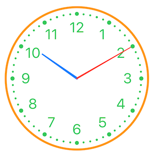

# SwiftClockUI


Clock UI for SwiftUI

This library has been tested
* ✅💻 macOS Catalina 10.15.3
* ✅💻 macOS Big Sur 11.6
* ✅📱 iOS 13
* ✅📱 iOS 14
* ✅📱 iOS 15

*For compatibility with Xcode version older than 13.3, I would recommend to checkout the 1.4.x tag, it should compile with Xcode 11 and greater*

## Bind a date

```swift
struct ContentView: View {
    @State private var date = Date()

    var body: some View {
        ClockView().environment(\.clockDate, $date)
    }
}
```

Simply set `.environment(\.clockDate, $date)` `$date` has to be a binding.
If you want something constant (just for showing the time), you could pass `.constant(yourDate)`

* Arms move when date are set (take hour and minute in account)
* Move the Arms change the date (hour and minute depending on which arm you've moved)

## Change Clock style

There is 4 different clock style:

Style | Picture
------------ | -------------
Classic | 
Art Nouveau | 
Drawing | 
Steampunk | 

To set the style: `.environment(\.clockStyle, .steampunk)` for Steampunk style for instance.

```swift
struct ContentView: View {
    @State private var clockStyle: ClockStyle = .classic

    var body: some View {
        ClockView().environment(\.clockStyle, clockStyle)
    }
}
```

`\.clockStyle` is typed as `enum ClockStyle`  which is `Identifiable`, `CaseIterable`, and has a convenient method to get the description (in English): `public var description: String`

It's very useful when you want to iterate over this `enum` to let the user choose the clock style, for instance you can easily do something like this:

```swift
struct StylePicker: View {
    @Binding var clockStyle: ClockStyle

    var body: some View {
        Picker("Style", selection: clockStyle) {
            ForEach(ClockStyle.allCases) { style in
                Text(style.description).tag(style)
            }
        }
        .pickerStyle(SegmentedPickerStyle())
    }
}
```

## Change elements color

You can also change the color of Clock elements. Again with changing some `.environment` keys.

```swift
ClockView()
    .environment(\.clockArmColors, ClockArmColors(
        minute: .red,
        hour: .blue
    ))
    .environment(\.clockBorderColor, .orange)
    .environment(\.clockIndicatorsColor, .green)
```

In light mode, you could expect a result like this:



## Installation

### Xcode

You can add SwiftToTen to an Xcode project by adding it as a package dependency.

1. From the **File** menu, select **Swift Packages › Add Package Dependency...**
2. Enter "https://github.com/renaudjenny/SwiftClockUI" into the package repository URL test field

### As package dependency

Edit your `Package.swift` to add this library.

```swift
let package = Package(
    ...
    dependencies: [
        .package(url: "https://github.com/renaudjenny/SwiftClockUI", from: "2.0.0"),
        ...
    ],
    targets: [
        .target(
            name: "<Your project name>",
            dependencies: ["SwiftClockUI"]),
        ...
    ]
)
```

## App using this library

* [📲 Tell Time UK](https://apps.apple.com/gb/app/tell-time-uk/id1496541173): https://github.com/renaudjenny/telltime
