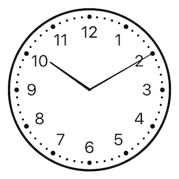
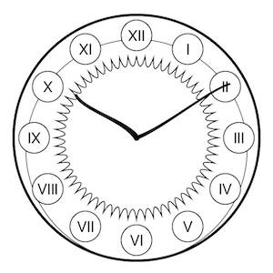
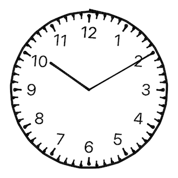
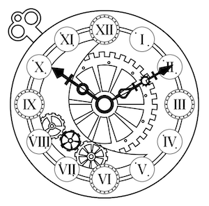

# SwiftClockUI

Clock UI for SwiftUI

⚠️ It's very unstable right now. I'm currently highly working on it and changing the code. Don't use it now!

This library has been tested
* ✅💻 macOS Catalina 10.15.3
* ✅📱 iOS 13.3

## Bind a date

```swift
struct ContentView: View {
    @State private var date = Date()

    var body: some View {
        ClockView().environment(\.clockDate, $date)
    }
}
```

Simply set `.environment(\.clockDate, $date)` `$date` has to be a binding.
If you want something constant (just for showing the time), you could pass `.constant(yourDate)`

* Arms move when date are set (take hour and minute in account)
* Move the Arms change the date (hour and minute depending on wich arm you've moved)

## Change Clock style

There is 4 different clock style:

Style | Picture
------------ | -------------
Classic | 
Art Nouveau | 
Drawing | 
Steampunk | 

To set the style: `.environment(\.clockStyle, .steampunk)` for Steampunk style for instance.

struct ContentView: View {
@State private var date = Date()

```swift
struct ContentView: View {
    @State private var clockStyle: ClockStyle = .classic

    var body: some View {
        ClockView().environment(\.clockStyle, clockStyle)
    }
}
```

`\.clockStyle` is typed as `enum ClockStyle`  which is `Identifiable`, `CaseIterable`, and has a convenient method to get the description (in English): `public var description: String`

It's very useful when you want to iterate over this to let the use choose the clock style, for instance you can easily do something like this:

```swift
struct StylePicker: View {
    @Binding var clockStyle: ClockStyle

    var body: some View {
        Picker("Style", selection: clockStyle) {
            ForEach(ClockStyle.allCases) { style in
                Text(style.description).tag(style)
            }
        }
        .pickerStyle(SegmentedPickerStyle())
    }
}
```

## TODO

* 📷 Add some demo pictures
* 📲 Add the link to the different apps who are using this library
* 👆 Add a bigger zone for dragging arms, it's not easy with the mouse on macOS
* 👾 Add a smooth animation while resizing the window on macOS
* ⚠️  Address TODO and FIXME
* 🧽 Add Linter rules
